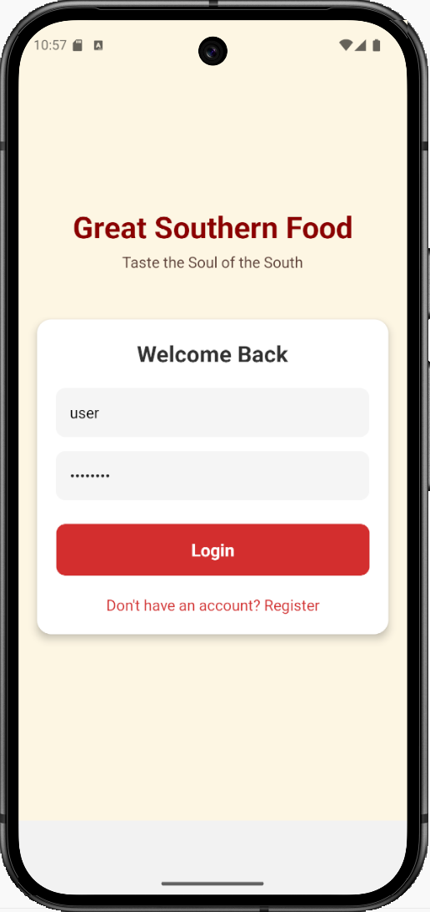
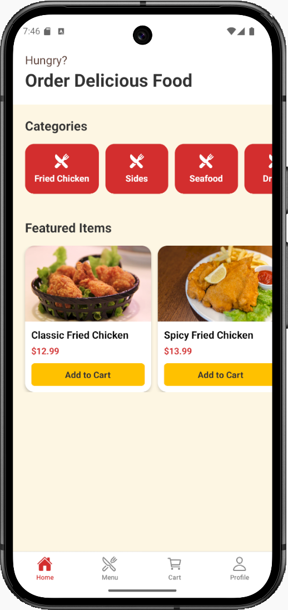
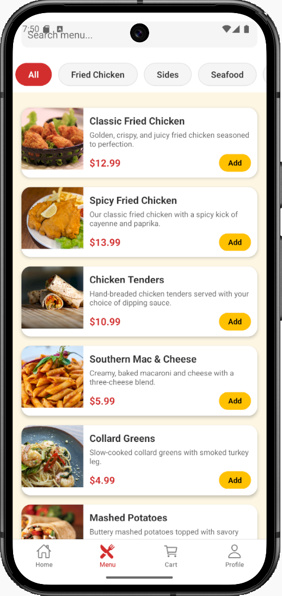
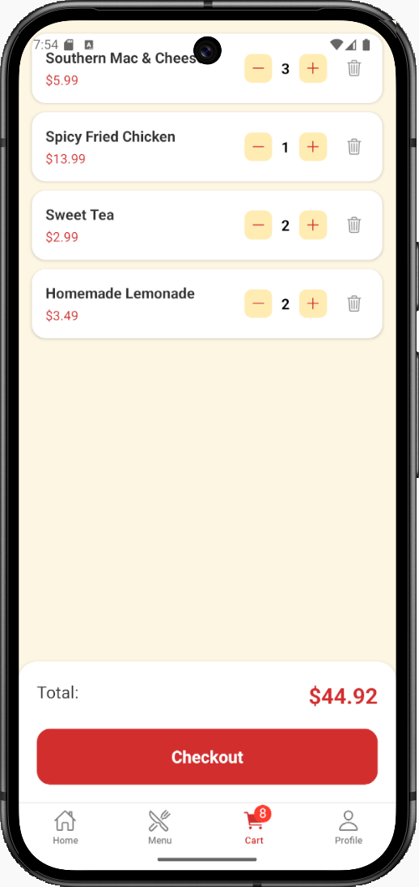
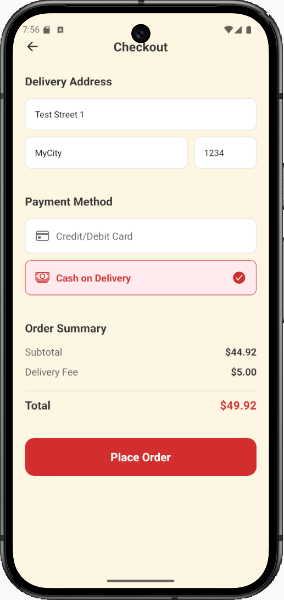
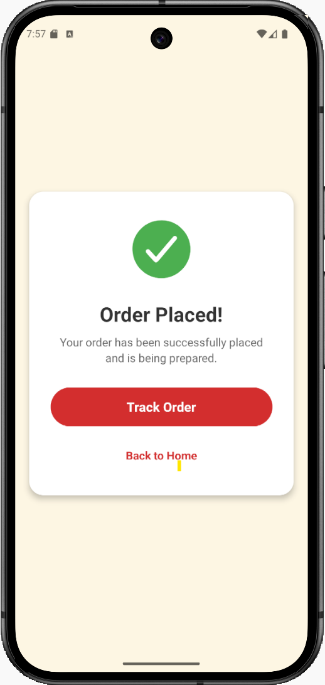
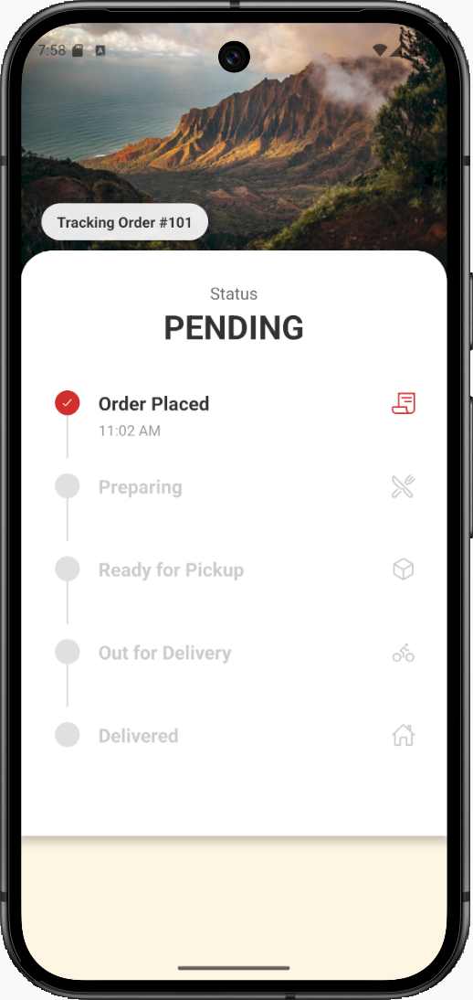
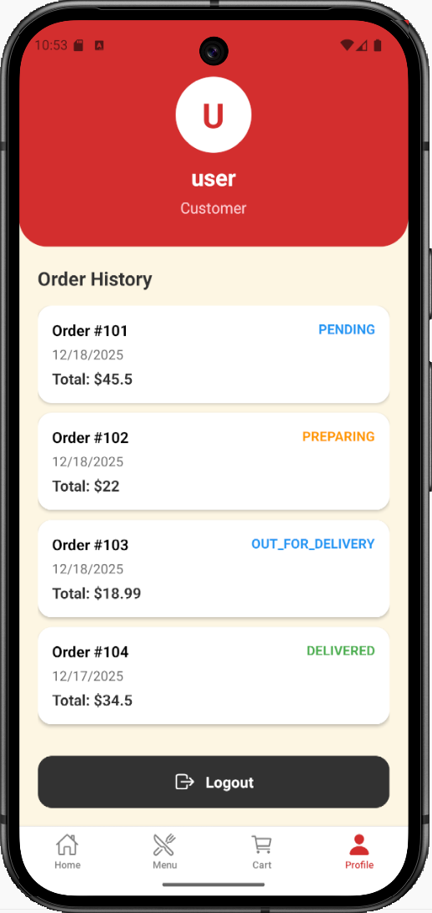

# Great Southern Food: A Native Mobile Food Delivery App Generated by Priset

[](https://priset.ai)
[](https://youtu.be/HJQ0pGn3cG4)
[](./LICENSE)

This repository contains the source code for **Great Southern Food**, a fully functional, native mobile food delivery application for both iOS and Android.

The entire project—from the initial architecture and database schema to the front-end components and back-end logic—was generated autonomously by **Priset**, our AI engineering partner, from a single high-level prompt. 

Great Southern Food App Screenshots:
<p align="center">
  
  
  
  
  
  
  
  
  
</p> 

---

## 🚀 Generated by Priset: The 30-Minute Challenge

This repository serves as a public case study to demonstrate the power of autonomous, AI-driven software development. The goal was to test Priset's ability to create a complex, real-world application from scratch.

### The Prompt:
> *"Create a native mobile app for my restaurant named 'Great Southern Food' that will show the food menu, take orders and track deliveries. Provide sample data with beautiful pictures. Use node.js and SQLite database for the server. Create separate directories for client and server."*

### The Result:
In **30 minutes** of autonomous work, Priset:
1.  Architected a scalable solution using React Native.
2.  Generated the complete project structure, including all necessary files and dependencies.
3.  Wrote the code for all core features: user login, restaurant browsing, cart management, order delivery tracking.
4.  Created the backend functions and API interface.
5.  Produced clean, consistent, and production-ready code.

This project showcases how Priset can collapse weeks of manual development into minutes, freeing engineers to focus on vision and innovation. **[Learn more about Priset at priset.ai](https://www.priset.ai)**.

---

## ✨ Features

*   **User Authentication:** Secure sign-up and login for users.
*   **Menu Browsing:** View detailed menus for each food category with items and prices.
*   **Shopping Cart:** Add/remove items and view your order total in real-time.
*   **Order Delivery Tracking:** View current orders and their delivery status.

---

## 🛠️ Tech Stack

*   **Frontend:** React Native
*   **Backend & Database:** SQLite
*   **State Management:** React Context
*   **Navigation:** React Navigation

---

## 🏁 Getting Started

Follow these instructions to get a local copy up and running for development and testing purposes.

### Prerequisites

You will need the following tools installed on your machine:
*   [Node.js](https://nodejs.org/) (LTS version recommended)
*   [npm](https://www.npmjs.com/)
*   [React Native development environment](https://reactnative.dev/docs/environment-setup) (including Xcode for iOS and Android Studio for Android)

### Installation & Setup

1.  **Clone the repository:**
    ```sh
    git clone https://github.com/prisetadmin/FoodDeliveryNativeApp.git/
    cd FoodDeliveryNativeApp
    ```

2.  **Install dependencies:**
    ```sh
    cd server
    npm install
    cd ..
    cd client
    npm install
    ```

### Running the App
*   **Run the server:**
    ```sh
    cd server
    npm start
    ```

*   **To run on the iOS Simulator:**
    ```sh
    cd client
    npx react-native run-ios
    ```
*   **To run on the Android Emulator (use Pixel 9, API 35):**
    ```sh
    cd client
    npx expo start -c
    ```

---

## ⚠️ Disclaimer

This project is a **technology demonstration** intended to showcase the capabilities of Priset. It is not a production-ready, deployed product. The code is provided "as is" and is meant to serve as a powerful starting point. You are responsible for all security measures, API key management, and any costs associated with the third-party services used (Firebase, Stripe, etc.).

---

## 📄 License

This project is licensed under the MIT License - see the [LICENSE](LICENSE) file for details.
